# Technical Design Document

> **Document Version:** 1.0.0  
> **Last Updated:** 2025-11-30  
> **Status:** Draft → Ready for Implementation

---

## 1. Architecture Overview

### 1.1 System Architecture Pattern

Audio Toolkit follows a **Plugin-Based Layered Architecture** with four distinct layers:

```
┌─────────────────────────────────────────────────────────────────────┐
│                        PRESENTATION LAYER                           │
│  ┌─────────────┐  ┌─────────────┐  ┌─────────────────────────────┐ │
│  │   CLI       │  │  Python     │  │  Interactive Wizard (TUI)   │ │
│  │  (Typer)    │  │    API      │  │  (Rich + InquirerPy)        │ │
│  └─────────────┘  └─────────────┘  └─────────────────────────────┘ │
└─────────────────────────────────────────────────────────────────────┘
                                │
                                ▼
┌─────────────────────────────────────────────────────────────────────┐
│                        ORCHESTRATION LAYER                          │
│  ┌─────────────────┐  ┌─────────────────┐  ┌───────────────────┐   │
│  │ Pipeline Engine │  │ Session Manager │  │  Plugin Manager   │   │
│  │   (YAML DAG)    │  │ (Crash Recovery)│  │  (Entry Points)   │   │
│  └─────────────────┘  └─────────────────┘  └───────────────────┘   │
└─────────────────────────────────────────────────────────────────────┘
                                │
                                ▼
┌─────────────────────────────────────────────────────────────────────┐
│                        PROCESSING LAYER                             │
│  ┌──────────┐ ┌──────────┐ ┌──────────┐ ┌──────────┐ ┌──────────┐  │
│  │ Splitter │ │Converter │ │ Analyzer │ │  Voice   │ │Transcribe│  │
│  │          │ │          │ │          │ │ Enhance  │ │          │  │
│  └──────────┘ └──────────┘ └──────────┘ └──────────┘ └──────────┘  │
│                    ▲ Implements AudioProcessor Interface            │
└─────────────────────────────────────────────────────────────────────┘
                                │
                                ▼
┌─────────────────────────────────────────────────────────────────────┐
│                        INFRASTRUCTURE LAYER                         │
│  ┌─────────────┐  ┌─────────────┐  ┌─────────────┐  ┌───────────┐  │
│  │ File I/O   │  │  Logging    │  │  Config     │  │  Audio    │  │
│  │ (file_ops) │  │  (logger)   │  │  (YAML)     │  │  (pydub)  │  │
│  └─────────────┘  └─────────────┘  └─────────────┘  └───────────┘  │
└─────────────────────────────────────────────────────────────────────┘
```

### 1.2 Design Principles Applied

| Principle | Application |
|-----------|-------------|
| **Single Responsibility** | Each processor handles ONE operation (split, convert, etc.) |
| **Open/Closed** | New processors via plugin system, no core modifications |
| **Liskov Substitution** | All processors implement `AudioProcessor` interface |
| **Interface Segregation** | Small, focused interfaces (`AudioProcessor`, `SessionStore`) |
| **Dependency Inversion** | Processors depend on abstractions, not concrete implementations |

---

## 2. Directory Structure (Complete)

```
audio-toolkit/
├── .github/
│   └── copilot-instructions.md     # AI agent context
│
├── config/
│   ├── docker-compose.yml          # Container orchestration
│   ├── Dockerfile                  # Build image
│   └── .editorconfig               # Editor settings
│
├── data/                           # Runtime data (git-ignored)
│   ├── logs/                       # Application logs
│   │   └── audiotoolkit.log
│   ├── output/                     # Processed audio files
│   ├── sessions/                   # Session database (SQLite/JSON)
│   │   ├── sessions.db             # SQLite database
│   │   └── checkpoints/            # Per-session checkpoint files
│   └── presets/                    # User-saved wizard presets
│       └── *.yaml
│
├── docs/
│   ├── file-structure.md           # This structure documented
│   ├── backend/                    # Technical docs
│   ├── tests/                      # Test documentation
│   └── plugins/                    # Plugin development guide
│       └── creating-plugins.md
│
├── specs/                          # The "Brain" - Spec-Driven Development
│   ├── 00_context.md               # Project vision & goals
│   ├── 01_requirements.md          # EARS notation requirements
│   ├── 02_design.md                # THIS DOCUMENT
│   └── 03_plan.md                  # Implementation checklist
│
├── src/
│   ├── __init__.py
│   ├── main.py                     # CLI entry point (Typer app)
│   │
│   ├── core/                       # Abstract contracts (interfaces)
│   │   ├── __init__.py
│   │   ├── interfaces.py           # AudioProcessor, SessionStore, etc.
│   │   ├── types.py                # Shared type definitions
│   │   └── exceptions.py           # Custom exception hierarchy
│   │
│   ├── processors/                 # Concrete processor implementations
│   │   ├── __init__.py
│   │   ├── splitter/               # Smart Splitter (multi-file module)
│   │   │   ├── __init__.py
│   │   │   ├── fixed.py            # Fixed duration splitting
│   │   │   ├── silence.py          # Silence-based splitting
│   │   │   └── timestamp.py        # Timestamp file splitting
│   │   ├── converter.py            # Format converter
│   │   ├── metadata.py             # Metadata manager
│   │   ├── visualizer.py           # Mel-spectrogram & waveform
│   │   ├── statistics.py           # Audio stats & VAD
│   │   ├── noise_reduce.py         # Noise reduction
│   │   ├── dynamics.py             # Compression & EQ
│   │   ├── trimmer.py              # Silence trimming
│   │   └── transcriber.py          # LLM transcription wrapper
│   │
│   ├── orchestration/              # Pipeline & session management
│   │   ├── __init__.py
│   │   ├── pipeline.py             # Pipeline engine (YAML execution)
│   │   ├── session.py              # Session manager (crash recovery)
│   │   └── plugin_manager.py       # Plugin discovery & loading
│   │
│   ├── presentation/               # User interfaces
│   │   ├── __init__.py
│   │   ├── cli/                    # CLI commands (Typer)
│   │   │   ├── __init__.py
│   │   │   ├── split_cmd.py
│   │   │   ├── convert_cmd.py
│   │   │   ├── analyze_cmd.py
│   │   │   ├── voice_cmd.py
│   │   │   ├── pipeline_cmd.py
│   │   │   ├── session_cmd.py
│   │   │   └── plugin_cmd.py
│   │   ├── wizard/                 # Interactive TUI
│   │   │   ├── __init__.py
│   │   │   ├── main_menu.py
│   │   │   ├── split_wizard.py
│   │   │   ├── convert_wizard.py
│   │   │   └── preset_manager.py
│   │   └── api/                    # Python API (programmatic access)
│   │       ├── __init__.py
│   │       └── toolkit.py          # Facade for Python API usage
│   │
│   └── utils/                      # Shared utilities
│       ├── __init__.py
│       ├── file_ops.py             # File I/O, directory scanning
│       ├── logger.py               # Logging configuration (Rich)
│       ├── audio.py                # Audio loading/saving (pydub wrapper)
│       ├── config.py               # YAML config loader
│       ├── progress.py             # Progress bar utilities (Rich)
│       └── validators.py           # Input validation helpers
│
├── tests/
│   ├── __init__.py
│   ├── conftest.py                 # Pytest fixtures
│   ├── unit/
│   │   ├── test_splitter.py
│   │   ├── test_converter.py
│   │   └── test_session.py
│   ├── integration/
│   │   ├── test_pipeline.py
│   │   └── test_wizard.py
│   └── fixtures/
│       └── audio/                  # Test audio files
│           ├── 10sec_mono.wav
│           └── silence_gaps.mp3
│
├── .gitignore
├── changelog.md
├── contributing.md
├── readme.md
├── requirements.txt
├── requirements-dev.txt            # Dev dependencies (pytest, etc.)
└── pyproject.toml                  # Project metadata & plugin config
```

---

## 3. Data Flow Diagrams

### 3.1 High-Level System Flow


### 3.2 Session Management Flow (Crash Recovery)

```mermaid
sequenceDiagram
    participant U as User
    participant CLI as CLI/Wizard
    participant SM as Session Manager
    participant DB as Session DB
    participant P as Processor
    participant FS as File System

    U->>CLI: audiotoolkit split --input ./audio
    CLI->>SM: start_session(config)
    SM->>DB: CREATE session (status=in_progress)
    SM-->>CLI: session_id

    loop For each file
        SM->>DB: UPDATE file status=processing
        SM->>P: process(file)
        P->>FS: Write output
        P-->>SM: ProcessResult
        SM->>DB: UPDATE file status=completed/failed
        
        alt Every N files (checkpoint)
            SM->>DB: COMMIT checkpoint
        end
    end

    SM->>DB: UPDATE session status=completed
    SM-->>CLI: Summary Report
    CLI-->>U: ✅ Done! 1000 files processed

    Note over U,FS: --- CRASH SCENARIO ---

    U->>CLI: audiotoolkit --resume
    CLI->>SM: resume_session(latest)
    SM->>DB: SELECT incomplete session
    SM->>DB: SELECT files WHERE status != completed
    
    loop For remaining files only
        SM->>P: process(file)
        P-->>SM: ProcessResult
        SM->>DB: UPDATE file status
    end

    SM-->>CLI: ✅ Resumed! 1 file remaining processed
```



### 3.3 Pipeline Execution Flow


### 3.4 Plugin Discovery Flow


---

## 4. Core Interfaces (Contracts)

### 4.1 AudioProcessor Interface

```python
# src/core/interfaces.py
from abc import ABC, abstractmethod
from dataclasses import dataclass, field
from pathlib import Path
from typing import Any, Dict, List, Optional
from enum import Enum

class ProcessorCategory(Enum):
    """Categories for organizing processors in UI."""
    CORE = "core"
    ANALYSIS = "analysis"
    VOICE = "voice"
    AUTOMATION = "automation"

@dataclass
class ParameterSpec:
    """Specification for a processor parameter (used for CLI/TUI generation)."""
    name: str
    param_type: str  # "int", "float", "str", "bool", "choice", "path"
    required: bool = False
    default: Any = None
    description: str = ""
    choices: Optional[List[Any]] = None
    min_value: Optional[float] = None
    max_value: Optional[float] = None

@dataclass
class ProcessResult:
    """Result of a single file processing operation."""
    success: bool
    input_path: Path
    output_path: Optional[Path] = None
    output_paths: List[Path] = field(default_factory=list)  # For splitter (multiple outputs)
    metadata: Dict[str, Any] = field(default_factory=dict)
    error: Optional[str] = None
    processing_time_ms: float = 0.0

class AudioProcessor(ABC):
    """
    Base interface all processors/plugins MUST implement.
    
    Contract:
    - Must be stateless (no instance state between process() calls)
    - Must handle single files (batch orchestrated by Session Manager)
    - Must return ProcessResult (never raise unhandled exceptions)
    """

    @property
    @abstractmethod
    def name(self) -> str:
        """Unique processor identifier (e.g., 'splitter-fixed')."""
        pass

    @property
    @abstractmethod
    def version(self) -> str:
        """Semantic version (e.g., '1.0.0')."""
        pass

    @property
    @abstractmethod
    def description(self) -> str:
        """One-line description for --plugins list."""
        pass

    @property
    def category(self) -> ProcessorCategory:
        """Category for UI grouping. Override in subclass."""
        return ProcessorCategory.CORE

    @abstractmethod
    def get_parameters(self) -> List[ParameterSpec]:
        """
        Return list of configurable parameters.
        Used by CLI to generate --flags and by TUI to generate prompts.
        """
        pass

    @abstractmethod
    def process(
        self,
        input_path: Path,
        output_dir: Path,
        **kwargs: Any
    ) -> ProcessResult:
        """
        Execute the processor on a single file.
        
        Args:
            input_path: Path to input audio file
            output_dir: Directory to write output(s)
            **kwargs: Parameters from get_parameters()
        
        Returns:
            ProcessResult with success/failure and output paths
        """
        pass

    def validate_config(self, config: Dict[str, Any]) -> List[str]:
        """
        Optional: Validate configuration before processing.
        Returns list of error messages (empty if valid).
        """
        errors = []
        for param in self.get_parameters():
            if param.required and param.name not in config:
                errors.append(f"Missing required parameter: {param.name}")
        return errors
```

### 4.2 Session Store Interface

```python
# src/core/interfaces.py (continued)
from datetime import datetime
from enum import Enum

class SessionStatus(Enum):
    IN_PROGRESS = "in_progress"
    COMPLETED = "completed"
    FAILED = "failed"
    PAUSED = "paused"

class FileStatus(Enum):
    PENDING = "pending"
    PROCESSING = "processing"
    COMPLETED = "completed"
    FAILED = "failed"
    SKIPPED = "skipped"

@dataclass
class FileRecord:
    """Tracks processing state of a single file."""
    path: Path
    status: FileStatus = FileStatus.PENDING
    output_path: Optional[Path] = None
    checksum: Optional[str] = None
    error: Optional[str] = None
    processed_at: Optional[datetime] = None

@dataclass
class Session:
    """Represents a batch processing session."""
    id: str
    created_at: datetime
    updated_at: datetime
    status: SessionStatus
    operation: str  # "split", "convert", "pipeline"
    config: Dict[str, Any]
    total_files: int
    completed_count: int = 0
    failed_count: int = 0
    files: List[FileRecord] = field(default_factory=list)

class SessionStore(ABC):
    """
    Interface for session persistence (SQLite or JSON implementation).
    """

    @abstractmethod
    def create_session(self, operation: str, config: Dict[str, Any], files: List[Path]) -> Session:
        """Create a new session and return it."""
        pass

    @abstractmethod
    def get_session(self, session_id: str) -> Optional[Session]:
        """Retrieve a session by ID."""
        pass

    @abstractmethod
    def get_latest_incomplete(self) -> Optional[Session]:
        """Get the most recent incomplete session."""
        pass

    @abstractmethod
    def update_file_status(
        self,
        session_id: str,
        file_path: Path,
        status: FileStatus,
        output_path: Optional[Path] = None,
        error: Optional[str] = None
    ) -> None:
        """Update the processing status of a file."""
        pass

    @abstractmethod
    def checkpoint(self, session_id: str) -> None:
        """Force a checkpoint (commit to disk)."""
        pass

    @abstractmethod
    def complete_session(self, session_id: str, status: SessionStatus) -> None:
        """Mark session as completed/failed."""
        pass

    @abstractmethod
    def list_sessions(self, limit: int = 10) -> List[Session]:
        """List recent sessions."""
        pass

    @abstractmethod
    def delete_sessions_older_than(self, days: int) -> int:
        """Purge old sessions, return count deleted."""
        pass
```

### 4.3 Pipeline Configuration Schema

```yaml
# Example: pipeline.yaml
name: "podcast-prep"
description: "Full podcast episode preparation pipeline"
version: "1.0"

# Global settings
settings:
  checkpoint_interval: 50
  continue_on_error: false
  output_dir: "./data/output/{{date}}"

# Input specification
input:
  path: "./raw-episodes"
  recursive: true
  formats: ["mp3", "wav", "m4a"]

# Processing steps (executed in order)
steps:
  - name: normalize
    processor: converter
    params:
      normalize: true
      target_lufs: -14

  - name: clean-audio
    processor: noise-reduce
    params:
      strength: medium

  - name: split-segments
    processor: splitter-silence
    params:
      threshold_db: -40
      min_silence_ms: 500
      min_segment_ms: 5000

  - name: transcribe
    processor: transcriber
    params:
      model: whisper
      output_format: srt
```

---

## 5. Data Schemas

### 5.1 Session Database Schema (SQLite)

```sql
-- data/sessions/sessions.db

CREATE TABLE sessions (
    id TEXT PRIMARY KEY,
    created_at TIMESTAMP NOT NULL DEFAULT CURRENT_TIMESTAMP,
    updated_at TIMESTAMP NOT NULL DEFAULT CURRENT_TIMESTAMP,
    status TEXT NOT NULL CHECK (status IN ('in_progress', 'completed', 'failed', 'paused')),
    operation TEXT NOT NULL,
    config_json TEXT NOT NULL,
    total_files INTEGER NOT NULL DEFAULT 0,
    completed_count INTEGER NOT NULL DEFAULT 0,
    failed_count INTEGER NOT NULL DEFAULT 0
);

CREATE TABLE session_files (
    id INTEGER PRIMARY KEY AUTOINCREMENT,
    session_id TEXT NOT NULL REFERENCES sessions(id) ON DELETE CASCADE,
    file_path TEXT NOT NULL,
    status TEXT NOT NULL CHECK (status IN ('pending', 'processing', 'completed', 'failed', 'skipped')),
    output_path TEXT,
    checksum TEXT,
    error TEXT,
    processed_at TIMESTAMP,
    UNIQUE(session_id, file_path)
);

CREATE INDEX idx_session_files_status ON session_files(session_id, status);
CREATE INDEX idx_sessions_status ON sessions(status);
```

### 5.2 Preset Configuration Schema

```yaml
# ~/.audiotoolkit/presets/podcast-split.yaml
name: "podcast-split"
created_at: "2025-11-30T10:00:00Z"
operation: "split"
config:
  mode: "silence"
  threshold_db: -40
  min_silence_ms: 500
  input_path: null  # Prompt at runtime
  output_dir: "./output"
  output_format: "wav"
```

### 5.3 Audio File Metadata Schema (JSON Export)

```json
{
  "file": "episode-42.mp3",
  "format": "mp3",
  "duration_seconds": 3600.5,
  "sample_rate": 44100,
  "channels": 2,
  "bit_depth": 16,
  "tags": {
    "title": "Episode 42: The Answer",
    "artist": "Podcast Host",
    "album": "My Podcast",
    "year": "2025",
    "genre": "Podcast"
  },
  "statistics": {
    "rms_db": -18.5,
    "peak_db": -3.2,
    "silence_ratio": 0.12,
    "lufs": -16.2
  }
}
```

---

## 6. Component Interactions

### 6.1 CLI Command Registration

```python
# src/main.py
import typer
from src.presentation.cli import (
    split_cmd, convert_cmd, analyze_cmd,
    voice_cmd, pipeline_cmd, session_cmd, plugin_cmd
)
from src.presentation.wizard import main_menu

app = typer.Typer(
    name="audiotoolkit",
    help="🎵 Audio Toolkit - Batch audio processing platform",
    no_args_is_help=False,  # Launch wizard if no args
)

# Register command groups
app.add_typer(split_cmd.app, name="split", help="Split audio files")
app.add_typer(convert_cmd.app, name="convert", help="Convert audio formats")
app.add_typer(analyze_cmd.app, name="analyze", help="Analyze audio files")
app.add_typer(voice_cmd.app, name="voice", help="Voice enhancement tools")
app.add_typer(pipeline_cmd.app, name="pipeline", help="Run processing pipelines")
app.add_typer(session_cmd.app, name="sessions", help="Manage processing sessions")
app.add_typer(plugin_cmd.app, name="plugins", help="Manage plugins")

@app.callback(invoke_without_command=True)
def main(ctx: typer.Context, wizard: bool = typer.Option(False, "--wizard", "-w")):
    """Launch Audio Toolkit. No args = Interactive Wizard."""
    if ctx.invoked_subcommand is None or wizard:
        main_menu.launch()

if __name__ == "__main__":
    app()
```

### 6.2 Processor Registration (Dependency Injection)

```python
# src/orchestration/plugin_manager.py
from importlib.metadata import entry_points
from typing import Dict, Type
from src.core.interfaces import AudioProcessor

class PluginManager:
    """Discovers and manages all available processors."""
    
    _processors: Dict[str, Type[AudioProcessor]] = {}
    _instances: Dict[str, AudioProcessor] = {}

    @classmethod
    def discover(cls) -> None:
        """Load all processors from entry_points and built-ins."""
        # Built-in processors
        from src.processors import (
            splitter, converter, metadata, visualizer,
            statistics, noise_reduce, dynamics, trimmer, transcriber
        )
        
        # Register built-ins
        for processor_class in [
            splitter.FixedSplitter,
            splitter.SilenceSplitter,
            splitter.TimestampSplitter,
            converter.FormatConverter,
            # ... etc
        ]:
            instance = processor_class()
            cls._processors[instance.name] = processor_class
            cls._instances[instance.name] = instance

        # Discover third-party plugins
        eps = entry_points(group="audiotoolkit.plugins")
        for ep in eps:
            try:
                plugin_class = ep.load()
                instance = plugin_class()
                if not isinstance(instance, AudioProcessor):
                    raise TypeError(f"Plugin must implement AudioProcessor")
                cls._processors[instance.name] = plugin_class
                cls._instances[instance.name] = instance
            except Exception as e:
                # Log warning, continue loading other plugins
                pass

    @classmethod
    def get(cls, name: str) -> AudioProcessor:
        """Get processor instance by name."""
        if name not in cls._instances:
            raise KeyError(f"Unknown processor: {name}. Available: {list(cls._instances.keys())}")
        return cls._instances[name]

    @classmethod
    def list_all(cls) -> Dict[str, AudioProcessor]:
        """Return all registered processors."""
        return cls._instances.copy()
```

### 6.3 Session Manager Integration

```python
# src/orchestration/session.py
from pathlib import Path
from typing import Callable, List, Optional
from src.core.interfaces import (
    AudioProcessor, ProcessResult, Session, SessionStore, FileStatus
)
from src.utils.progress import ProgressReporter

class SessionManager:
    """Orchestrates batch processing with crash recovery."""

    def __init__(
        self,
        store: SessionStore,
        checkpoint_interval: int = 100,
        progress: Optional[ProgressReporter] = None
    ):
        self.store = store
        self.checkpoint_interval = checkpoint_interval
        self.progress = progress or ProgressReporter()
        self._current_session: Optional[Session] = None

    def run_batch(
        self,
        processor: AudioProcessor,
        input_files: List[Path],
        output_dir: Path,
        config: dict,
        resume_session_id: Optional[str] = None
    ) -> Session:
        """
        Execute processor on all files with checkpointing.
        
        If resume_session_id is provided, continues from last checkpoint.
        """
        if resume_session_id:
            session = self.store.get_session(resume_session_id)
            files_to_process = [
                f.path for f in session.files 
                if f.status not in (FileStatus.COMPLETED, FileStatus.SKIPPED)
            ]
        else:
            session = self.store.create_session(
                operation=processor.name,
                config=config,
                files=input_files
            )
            files_to_process = input_files

        self._current_session = session
        processed_count = 0

        self.progress.start(total=len(files_to_process), description=f"Processing with {processor.name}")

        for file_path in files_to_process:
            self.store.update_file_status(session.id, file_path, FileStatus.PROCESSING)
            
            try:
                result = processor.process(file_path, output_dir, **config)
                status = FileStatus.COMPLETED if result.success else FileStatus.FAILED
                self.store.update_file_status(
                    session.id, file_path, status,
                    output_path=result.output_path,
                    error=result.error
                )
            except Exception as e:
                self.store.update_file_status(
                    session.id, file_path, FileStatus.FAILED, error=str(e)
                )

            processed_count += 1
            self.progress.update(1)

            # Checkpoint every N files
            if processed_count % self.checkpoint_interval == 0:
                self.store.checkpoint(session.id)

        self.store.complete_session(session.id, SessionStatus.COMPLETED)
        self.progress.finish()
        
        return self.store.get_session(session.id)
```

---

## 7. Error Handling Strategy

### 7.1 Exception Hierarchy

```python
# src/core/exceptions.py

class AudioToolkitError(Exception):
    """Base exception for all Audio Toolkit errors."""
    pass

# Configuration Errors
class ConfigError(AudioToolkitError):
    """Invalid configuration."""
    pass

class InvalidYAMLError(ConfigError):
    """YAML parsing failed."""
    pass

class MissingParameterError(ConfigError):
    """Required parameter not provided."""
    pass

# Processing Errors
class ProcessingError(AudioToolkitError):
    """Error during audio processing."""
    pass

class CorruptedFileError(ProcessingError):
    """Audio file is corrupted or unreadable."""
    pass

class UnsupportedFormatError(ProcessingError):
    """Audio format not supported."""
    pass

# Session Errors
class SessionError(AudioToolkitError):
    """Session management error."""
    pass

class SessionLockedError(SessionError):
    """Session is locked by another process."""
    pass

class SessionNotFoundError(SessionError):
    """Session ID not found."""
    pass

# Plugin Errors
class PluginError(AudioToolkitError):
    """Plugin loading or execution error."""
    pass

class PluginInterfaceError(PluginError):
    """Plugin doesn't implement required interface."""
    pass
```

### 7.2 Error Handling Rules

| Error Type | Behavior | User Message |
|------------|----------|--------------|
| `CorruptedFileError` | Skip file, log, continue batch | "⚠️ Skipped corrupted file: {path}" |
| `UnsupportedFormatError` | Skip file, log, continue batch | "⚠️ Unsupported format: {path}" |
| `InvalidYAMLError` | Fail fast, abort | "❌ Invalid config: {error}" |
| `SessionLockedError` | Abort | "❌ Session locked by another process" |
| `PluginError` | Skip plugin, continue | "⚠️ Plugin failed to load: {name}" |

---

## 8. Testing Strategy

### 8.1 Test Categories

| Category | Location | Purpose |
|----------|----------|---------|
| Unit Tests | `tests/unit/` | Test individual processors in isolation |
| Integration Tests | `tests/integration/` | Test pipelines, session recovery |
| E2E Tests | `tests/e2e/` | Test CLI commands end-to-end |
| Fixtures | `tests/fixtures/audio/` | Sample audio files for testing |

### 8.2 Test Naming Convention

```python
# tests/unit/test_splitter.py

def test_fixed_splitter_produces_correct_segment_count():
    """SPLIT-001: 10-minute file with 60s duration = 10 segments."""
    pass

def test_fixed_splitter_handles_short_file():
    """EC-SPLIT-1: File shorter than duration = 1 segment + warning."""
    pass

def test_silence_splitter_detects_pauses():
    """AC-SPLIT-3: -40dB threshold, 0.5s min = correct split points."""
    pass
```

---

## 9. Dependencies

### 9.1 Core Dependencies (requirements.txt)

```
# Audio Processing
pydub>=0.25.1
librosa>=0.10.0
soundfile>=0.12.0

# CLI & TUI
typer>=0.9.0
rich>=13.0.0
InquirerPy>=0.3.4

# Configuration
pyyaml>=6.0
pydantic>=2.0

# Utilities
tqdm>=4.65.0

# Transcription (optional)
openai-whisper>=20230918
google-generativeai>=0.3.0
```

### 9.2 Development Dependencies (requirements-dev.txt)

```
pytest>=7.4.0
pytest-cov>=4.1.0
pytest-mock>=3.11.0
black>=23.7.0
ruff>=0.0.280
mypy>=1.5.0
```

---

## 10. Implementation Priority

Based on requirements traceability and dependencies:

| Phase | Components | Requirements |
|-------|------------|--------------|
| **Phase 1: Foundation** | Core interfaces, Logger, File I/O, Config | U-001 to U-006 |
| **Phase 2: MVP** | Splitter (fixed), Converter, CLI | SPLIT-001, CONV-001 |
| **Phase 3: Reliability** | Session Manager, Crash Recovery | SESSION-001 to SESSION-008 |
| **Phase 4: UX** | Interactive Wizard, Progress bars | WIZARD-001 to WIZARD-008 |
| **Phase 5: Scale** | Pipeline Engine, Plugin System | PIPE-001 to PIPE-004, PLUGIN-001 to PLUGIN-007 |
| **Phase 6: Advanced** | Analysis, Voice Tools, Transcriber | VIS-*, STAT-*, NOISE-*, TRANS-* |

---

## Appendix A: CLI Command Reference

```bash
# Core Commands
audiotoolkit split --mode fixed --duration 30 --input ./audio
audiotoolkit split --mode silence --threshold -40 --input ./audio
audiotoolkit convert --format wav --normalize --input ./audio

# Session Commands
audiotoolkit sessions list
audiotoolkit sessions --resume
audiotoolkit sessions clean --older-than 7d

# Pipeline Commands
audiotoolkit pipeline run --config ./pipeline.yaml
audiotoolkit pipeline run --config ./pipeline.yaml --dry-run

# Plugin Commands
audiotoolkit plugins list
audiotoolkit plugins info noise-reduce

# Wizard Mode
audiotoolkit              # No args = launch wizard
audiotoolkit --wizard     # Explicit wizard mode
audiotoolkit --preset daily  # Load saved preset
```
